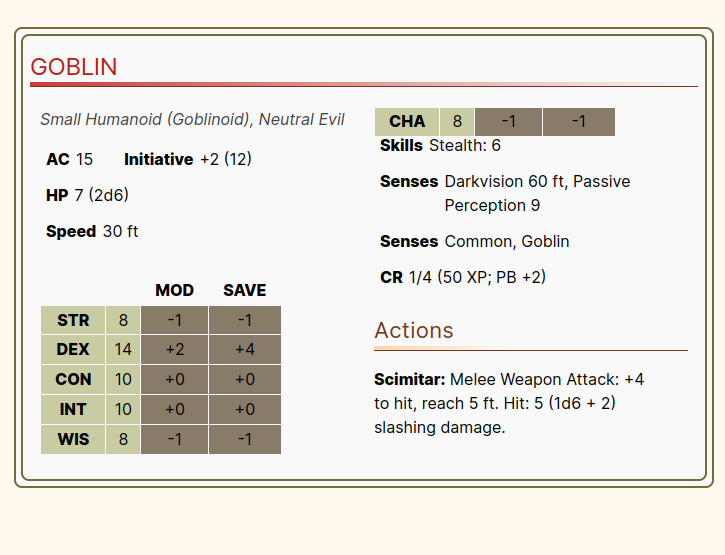

# Creature Stat Block Plugin for Obsidian

This plugin allows you to create beautifully formatted creature stat blocks in Obsidian using a simple YAML syntax. It is designed for Dungeon Masters and players who want to quickly generate and display stat blocks for creatures in their notes.

---

## Features

- Easy-to-Use YAML Syntax: Define creature stat blocks using a simple YAML structure.

- Automatic Formatting: The plugin automatically formats the stat block with a clean, professional layout.

- Customizable Fields: Only include the fields you need—skip optional fields to keep your stat blocks concise.

- Linked Content: Use Obsidian's internal linking syntax ([[link]]) to connect your stat blocks to other notes.
- Responsive Design: The stat block layout adapts to fit your notes seamlessly.

--- 

## Manual Installation
Since this plugin is not yet available in the Obsidian plugin repository, you can install it manually by following these steps:

### Step 1: Download the Plugin

1. Download the latest release of the plugin from the GitHub repository.
2. Extract the downloaded .zip file to a folder on your computer.

### Step 2: Add the Plugin to Obsidian

1. Open Obsidian.
2. Navigate to your vault's .obsidian/plugins folder:
3. Create a new folder inside the plugins folder and name it creature-stat-block-plugin.
4. Copy the contents of the extracted .zip file into the creature-stat-block-plugin folder.

### Step 3: Enable the Plugin

1. Open Obsidian.
2. Go to Settings → Community plugins.
3. Under Installed plugins, find Creature Stat Block Plugin and enable it.

---

## Usage

To create a creature stat block, use the sblock code block with YAML syntax. Here's an example:
~~~
```sblock
name: "Goblin"
creature_type: "Small Humanoid (Goblinoid)"
alignment: "Neutral Evil"
ac: 15
hp: "7 (2d6)"
speed: "30 ft"
cr: "1/4"
scores: [8, 14, 10, 10, 8, 8]
saves:
  - dex
skills:
  - "Stealth": 6
senses: "Darkvision 60 ft, Passive Perception 9"
languages: "Common, Goblin"
actions:
  - name: "Scimitar"
    desc: "Melee Weapon Attack: +4 to hit, reach 5 ft. Hit: 5 (1d6 + 2) slashing damage."
```
~~~

**Result**
The plugin will render the stat block like this:



---

## Available Fields

Here’s a list of all the fields you can include in your YAML stat block. All fields are optional, so you can omit any that aren’t relevant to your creature.

**Basic Information**

- `name`: The name of the creature (e.g., "Goblin").
- `creature_type`: The creature's type and subtype (e.g., "Small Humanoid (Goblinoid)").
- `alignment`: The creature's alignment (e.g., "Neutral Evil").

**Stats**

- `ac`: Armor Class (e.g., 15).
- `hp`: Hit Points (e.g., "7 (2d6)").
- `speed`: Movement speed (e.g., "30 ft").
- `cr`: Challenge Rating (e.g., "1/4").
- `scores`: Ability scores as an array [str, dex, con, int, wis, cha] (e.g., [8, 14, 10, 10, 8, 8]).
- `saves`: Saving throw proficiencies (e.g., ["dex", "con"]).
- `skills`: Skills and their bonuses (e.g., {"Stealth": 6}).

**Defenses**

- `condition_immunities`: Conditions the creature is immune to (e.g., "Frightened").
- `damage_vulnerabilities`: Damage types the creature is vulnerable to (e.g., "Fire").
- `damage_resistances`: Damage types the creature resists (e.g., "Bludgeoning").
- `damage_immunities`: Damage types the creature is immune to (e.g., "Poison").

**Senses and Languages**

- `senses`: Special senses (e.g., "Darkvision 60 ft").
- `languages`: Languages the creature speaks (e.g., "Common, Goblin").

**Actions**

- `actions`: A list of actions the creature can take. Each action has a name and desc.
```yaml
    actions:
      - name: "Scimitar"
        desc: "Melee Weapon Attack: +4 to hit, reach 5 ft. Hit: 5 (1d6 + 2) slashing damage."
```
- `bonus_actions`: A list of bonus actions.
- `reactions`: A list of reactions.
- `legendary_actions`: A list of legendary actions.

**Traits**

- `traits`: A list of special traits. Each trait has a name and desc.
```yaml
    traits:
      - name: "Nimble Escape"
        desc: "The goblin can take the Disengage or Hide action as a bonus action."
```
---

## Example Stat Block

Here’s a complete example of a Goblin stat block using all the available fields:

~~~
```sblock
name: "TEST goblin statblock"

creature_type: "Small Fey (Goblinoid)"
alignment: "Chaotic Neutral"
ac: 12
hp: 7 (2d6)
speed: "30ft"
cr: 1/8
scores: [8, 15, 10, 10, 8, 8]
saves:
    - dex
    - cha

skills:
   - "Stealth": 6 

condition_immunities: "your face"
vulnerabilities: "domething, and something else"
resistances: "he is super resistent"
immunities: "He is inmune to nothing"

gear:
  - "dagger": 3

senses: "Darkvision 60ft, Passive Perception 9"
languages: "Common, Goblin"

traits:
  - name: "Super Ugly"
    desc: "He is so ugly and disgusting!"

actions:
    - name: "Dagger"
      desc: "Melee or Ranged Attack Roll: +4, reach 5 ft. or range 20/60 ft. Hit: 4 (1d4 + 2) Piercing damage."

bonus_actions:
  - name: "Nimble Escape"
    desc: "The goblin takes the Disengage or Hide action."

reactions: 
  - name: "run"
    desc: "He is running so far when seeing you"

legendary_actions: 	
  - name: "Your mamma jokes"
    desc: "He able to talk about your mamma and doing very bad jokes"
```
~~~

---

## Customization
You can customize the appearance of the stat block by editing the CSS in your Obsidian theme. The plugin uses the following classes:

- `.creature-stat-block-outer`: The outer container.
- `.creature-stat-block-inner`: The inner container.
- `.creature-stat-block-content`: The content container.
- `.two-column-layout`: The two-column layout for the stat block.

---

## Contributing
If you’d like to contribute to this project, feel free to open an issue or submit a pull request on GitHub.

---

## License
This plugin is licensed under the MIT License. See the LICENSE file for details.
Enjoy creating stat blocks for your creatures! 🐉
